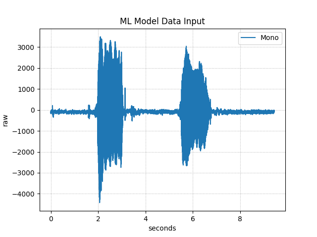
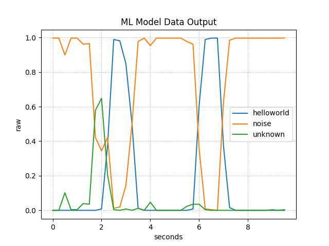

# SDS Recordings with STM32N6570-DK Board

## Overview
This folder contains SDS recordings captured with the **STM32N6570-DK** board.  
The recordings include microphone (audio in) data as well as machine learning (ML) inference results.
Metadata files describe the format and usage of these recordings.

## File description
- **DataInput.n.sds** – streams of microphone data used as input for ML.  
- **DataOutput.n.sds** – streams of ML inference results.  
- **DataInput.sds.yml** – metadata description for all `DataInput.n.sds` files.  
- **DataOutput.sds.yml** – metadata description for all `DataOutput.n.sds` files.  

### Available Recordings

`DataInput.0.sds` file contains **10 seconds** of microphone data (with 2 'helloworld').  
`DataOutput.0.sds` file contains **10 seconds** of ML inference results.

## Visualization
You can graphically represent SDS files using the **SDS-View** utility.

1. Copy the `sds-view.py` file from the SDS installation (`/utilities` sub-folder) into this folder.  
2. Run the following command to visualize an input recording:

   ```bash
   python sds-view.py -y DataInput.sds.yml -s DataInput.0.sds
   ```
   Example visualization:

   

3. To visualize an output recording:

   ```bash
   python sds-view.py -y DataOutput.sds.yml -s DataOutput.0.sds
   ```
   Example visualization:

   

## Audio data
You can convert recorded microphone data with **SDS-Convert** utility into a .wav format.

1. Copy the `sds-convert.py` file from the SDS installation (`/utilities` sub-folder) into this folder.  
2. Run the following command to convert input recording into a .wav file:

   ```bash
   python sds-convert.py audio_wav -i DataInput.0.sds -o DataInput.0.wav -y DataInput.sds.yml
   ```

You can now play `DataInput.0.wav` file in a media player to check what was recorded and fed to ML algorithm.
